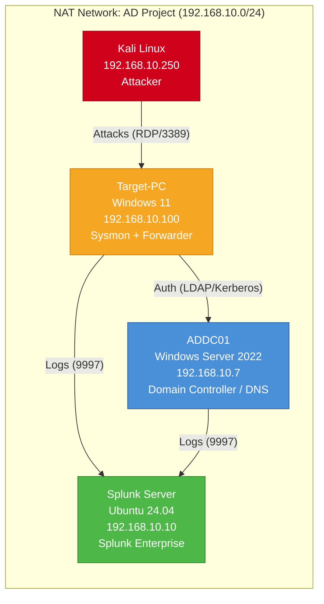

# Active Directory Detection Lab

A blue team home lab built to practice detecting real-world attacks against Active Directory using Splunk as a SIEM. The goal is to simulate the workflow of a SOC analyst: generate telemetry, identify malicious activity, write detection queries, and map findings to the MITRE ATT&CK framework.

Built following the [MyDFIR](https://www.youtube.com/@MyDFIR) Active Directory Project series, then extended with additional attack simulations, detection rules, and documentation.

---

## Lab Architecture



| Machine | OS | Role | IP Address |
|---------|------|------|------------|
| ADDC01 | Windows Server 2022 | Domain Controller (mydfir.local) | 192.168.10.7 |
| Splunk | Ubuntu Server 24.04 | SIEM — Splunk Enterprise | 192.168.10.10 |
| Target-PC (demo) | Windows 11 | Domain-joined workstation | 192.168.10.100 |
| Kali Linux | Kali 2025.x | Attacker machine | 192.168.10.250 |

**Virtualization:** Oracle VirtualBox 7.2 on Windows 11 host (32 GB RAM, NVMe SSD)

---

## Detection Coverage

| Detection | MITRE ATT&CK | Data Source | Splunk Query |
|-----------|-------------|-------------|--------------|
| RDP Brute Force | [T1110.001](https://attack.mitre.org/techniques/T1110/001/) | Security EventCode=4625 | [failed-logon-spike.spl](splunk-queries/failed-logon-spike.spl) |
| Local Account Creation | [T1136.001](https://attack.mitre.org/techniques/T1136/001/) | Security EventCode=4720 | [new-local-admin.spl](splunk-queries/new-local-admin.spl) |
| PowerShell Execution | [T1059.001](https://attack.mitre.org/techniques/T1059/001/) | Sysmon EventID=1 | [powershell-encoded-command.spl](splunk-queries/powershell-encoded-command.spl) |
| Scheduled Task Creation | [T1053.005](https://attack.mitre.org/techniques/T1053/005/) | Security EventCode=4698 | [suspicious-scheduled-task.spl](splunk-queries/suspicious-scheduled-task.spl) |

*Detection library is actively expanding. See [detections/](detections/) for full writeups with triage guidance.*

---

## Attack Simulation & Detection Walkthrough

### Example: RDP Brute Force (T1110.001)

**Attack:** From Kali, a password list is used to brute force RDP credentials against the Target-PC.

```bash
# Brute force RDP login for user tsmith
while IFS= read -r pass; do
  timeout 10 xfreerdp /v:192.168.10.100 /u:tsmith /p:"$pass" /cert:ignore +auth-only 2>&1 |
  grep -q "exit status 1" && echo ">>> SUCCESS: $pass <<<" && break
done < passwords.txt
```

**Detection:** In Splunk, multiple failed logon events (4625) appear in a short time window from a single source, followed by a successful logon (4624).

```spl
index=endpoint EventCode=4625
| stats count by src_ip, dest, user
| where count > 10
| sort -count
```

**Analyst Triage:**
1. Identify the source IP of the failed logons
2. Check if a successful logon (4624) follows from the same source — indicates compromise
3. Check if the account is now locked out (4740)
4. Escalate if successful logon is confirmed after brute force pattern

---

## Telemetry Sources

All logs are forwarded to Splunk via the Universal Forwarder into the `endpoint` index.

| Source | Log Type | Key Event IDs |
|--------|----------|--------------|
| Windows Security | Authentication, account management | 4624, 4625, 4720, 4740, 4698 |
| Windows System | Service changes, system events | 7045, 7040 |
| Windows Application | Application errors and warnings | 1000, 1001 |
| Sysmon (Operational) | Process creation, network, file, registry | 1, 3, 7, 8, 11, 13 |

**Sysmon Configuration:** Captures process creation (EID 1), network connections (EID 3), image loads (EID 7), and file creation (EID 11), providing deep endpoint visibility beyond default Windows logging.

---

## Splunk Practice Drills

12 hands-on exercises across 4 difficulty levels to build SPL query skills using this lab's real data. Each drill follows a **DO → FIND → UNDERSTAND** format: perform an action, write the Splunk query, then analyze what you found.

| Level | Focus | Drills |
|-------|-------|--------|
| **Level 1** | Basic Searches | Find logins, count events, explore data sources |
| **Level 2** | Attack Detection | RDP brute force, account creation, scheduled tasks, PowerShell |
| **Level 3** | Analyst Thinking | Full attack timelines, anomaly hunting, dashboard building |
| **Level 4** | Advanced SPL | Stats, timechart, eval, transaction correlation |

See the full drill set: [docs/splunk-practice-drills.md](docs/splunk-practice-drills.md)

---

## Tools & Technologies

- **Virtualization:** Oracle VirtualBox 7.2
- **Domain Services:** Windows Server 2022, Active Directory Domain Services
- **SIEM:** Splunk Enterprise (indexer + search head on Ubuntu Server)
- **Endpoint Telemetry:** Sysmon (Microsoft Sysinternals), Splunk Universal Forwarder
- **Attack Simulation:** Atomic Red Team (Red Canary), Kali Linux, xfreerdp
- **Framework:** MITRE ATT&CK

---

## Repository Structure

```
ad-detection-lab/
├── README.md
├── docs/
│   ├── lab-setup.md              # Full build guide
│   ├── splunk-setup.md           # Splunk indexer + forwarder config
│   ├── sysmon-config.md          # Sysmon configuration choices
│   ├── lessons-learned.md        # Troubleshooting and fixes
│   └── splunk-practice-drills.md # 12 hands-on SPL exercises (4 levels)
├── network-diagram/
│   └── ad-lab-topology.md        # Mermaid network diagram
├── detections/
│   ├── T1110.001_rdp-brute-force.md
│   ├── T1136.001_local-account-creation.md
│   ├── T1059.001_powershell-execution.md
│   └── T1053.005_scheduled-task-creation.md
├── splunk-queries/
│   ├── failed-logon-spike.spl
│   ├── new-local-admin.spl
│   ├── powershell-encoded-command.spl
│   └── suspicious-scheduled-task.spl
├── scripts/
│   ├── populate-ad.ps1           # Creates OUs, users, groups
│   ├── enable-audit-policies.ps1 # Applies recommended audit config
│   └── install-sysmon.ps1        # Sysmon deployment script
├── attack-simulations/
│   ├── atomic-red-team-tests.md
│   └── kali-rdp-bruteforce.md
└── screenshots/
```

---

## What I Learned

- **Sysmon is essential.** Default Windows logging misses most post-exploitation activity. Sysmon Event ID 1 (Process Creation) is the single most valuable log source for detecting attacks like PowerShell execution and scheduled task abuse.
- **Time sync matters.** When VM clocks drift, SIEM searches miss events entirely. In a production SOC, NTP configuration is one of the first things validated.
- **The attacker's perspective informs detection.** Running attacks from Kali and Atomic Red Team gave me direct insight into what telemetry each technique generates, making it easier to write targeted detection queries.
- **Index configuration is critical.** Searching the wrong Splunk index returns zero results even when data exists. Understanding data routing (inputs.conf, indexes) is foundational for any SIEM analyst.
- **FreeRDP version changes break tooling.** Crowbar (built for FreeRDP 2) silently fails with FreeRDP 3 due to reversed exit codes. Troubleshooting this reinforced the importance of understanding tool dependencies, not just running commands.

---

## Future Work

- [ ] Write Sigma rules (YAML) for each detection — vendor-agnostic, portable format
- [ ] Build a Splunk dashboard for SOC overview (failed logons, new accounts, suspicious processes)
- [ ] Add detections for lateral movement (T1021), credential dumping (T1003), and defense evasion (T1070)
- [ ] Create threat hunting playbooks (hypothesis-driven investigations)
- [ ] Integrate alerting with Splunk alerts for real-time notification
- [ ] Explore TheHive/Cortex for incident response case management

---

## Acknowledgments

- [MyDFIR](https://www.youtube.com/@MyDFIR) — Active Directory Project video series that inspired this lab
- [Red Canary / Atomic Red Team](https://github.com/redcanaryco/atomic-red-team) — Attack simulation framework
- [MITRE ATT&CK](https://attack.mitre.org/) — Threat framework used for detection mapping
- [Claude Code](https://claude.ai/code) — AI assistant used for troubleshooting lab issues and building this repository
