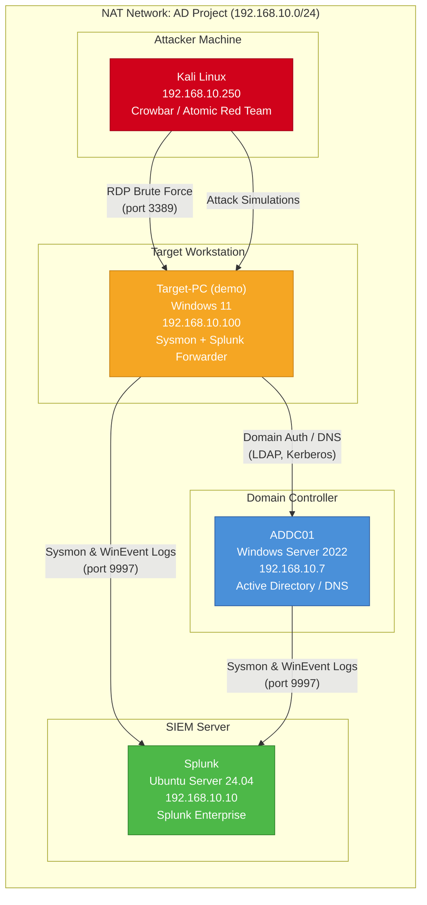

# AD Detection Lab — Network Topology

## Data Flow Summary

| Source | Destination | Protocol/Port | Purpose |
|--------|------------|---------------|---------|
| Target-PC | Splunk | TCP 9997 | Splunk Universal Forwarder (Sysmon, Security, System, Application logs) |
| ADDC01 | Splunk | TCP 9997 | Splunk Universal Forwarder (Sysmon, Security, System, Application logs) |
| Target-PC | ADDC01 | TCP 389/636, 88 | LDAP, Kerberos (Domain authentication, DNS) |
| Kali | Target-PC | TCP 3389 | RDP brute force attacks |
| Kali | Target-PC | Various | Attack simulations (Atomic Red Team) |
